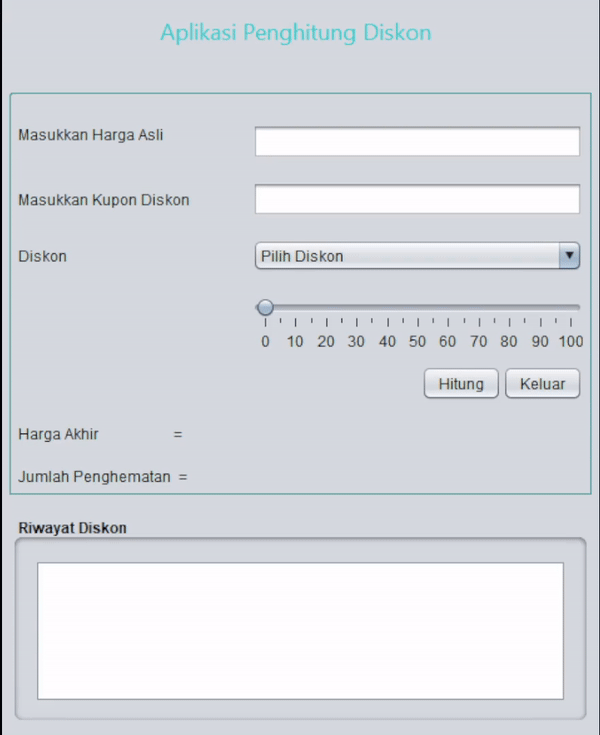

# Aplikasi Penghitung Diskon

Aplikasi Penghitung Diskon adalah aplikasi desktop berbasis Java menggunakan Swing yang membantu Anda menghitung harga akhir produk setelah diskon, termasuk diskon tambahan dengan kupon tertentu.

## Fitur

- **Input Harga Asli**: Pengguna dapat memasukkan harga asli produk.
- **Pilihan Diskon**: Diskon dapat dipilih melalui slider atau dari opsi yang telah ditentukan di `JComboBox`.
- **Kupon Diskon**: Menyediakan diskon tambahan jika pengguna memasukkan kupon yang valid:
  - **JumatBerkah**: Tambahan 15% diskon
  - **InyaBungas**: Tambahan 50% diskon
  - **Bismillah**: Tambahan 75% diskon
- **Validasi Input**: Hanya angka dan titik desimal yang diizinkan pada input harga.
- **Riwayat Diskon**: Menyimpan riwayat penghitungan diskon di dalam aplikasi.
- **Keluar**: Tombol untuk keluar dari aplikasi.

## Cara Menggunakan

1. **Masukkan Harga Asli**: Ketik harga asli produk di kolom yang tersedia.
2. **Pilih Diskon**: Gunakan slider untuk memilih diskon, atau pilih dari `JComboBox`.
3. **Masukkan Kupon Diskon (Opsional)**: Ketik kupon diskon yang valid untuk tambahan diskon.
4. **Klik Tombol "Hitung"**: Lihat hasil penghitungan harga akhir dan jumlah penghematan.
5. **Riwayat Diskon**: Riwayat penghitungan akan tampil di area teks.

## Prasyarat

- **Java Development Kit (JDK)**: Versi 8 atau lebih baru.
- **NetBeans**: Untuk menjalankan dan memodifikasi proyek.

# Demo

# Pembuat Aplikasi
 Muhammad Akmal ( 2210010437 ) 
